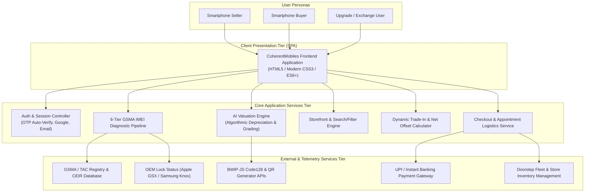
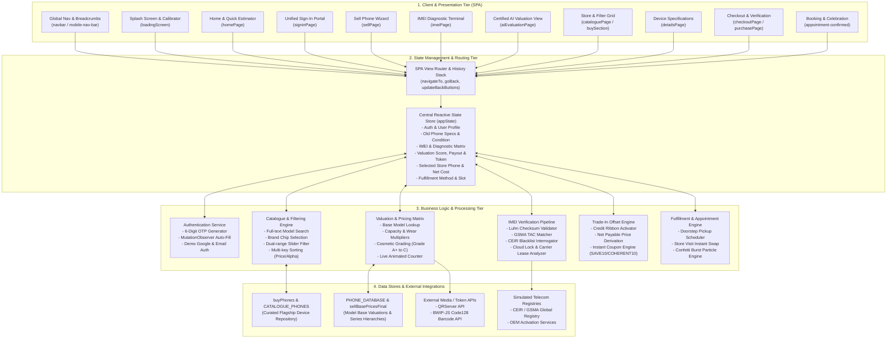
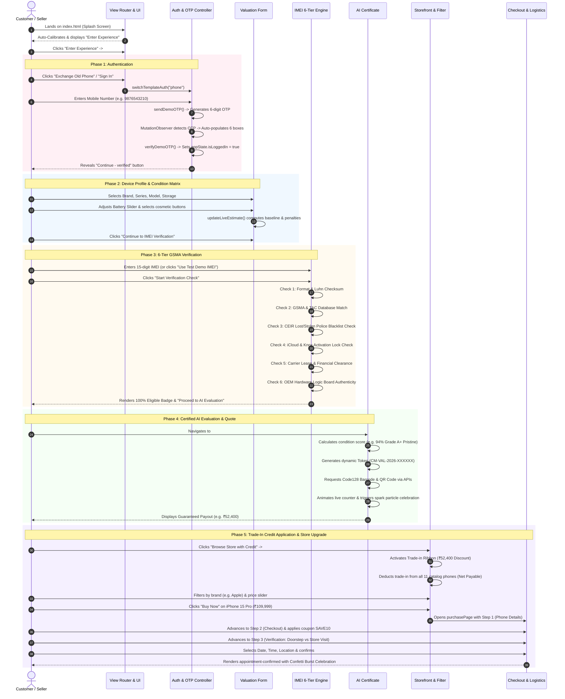
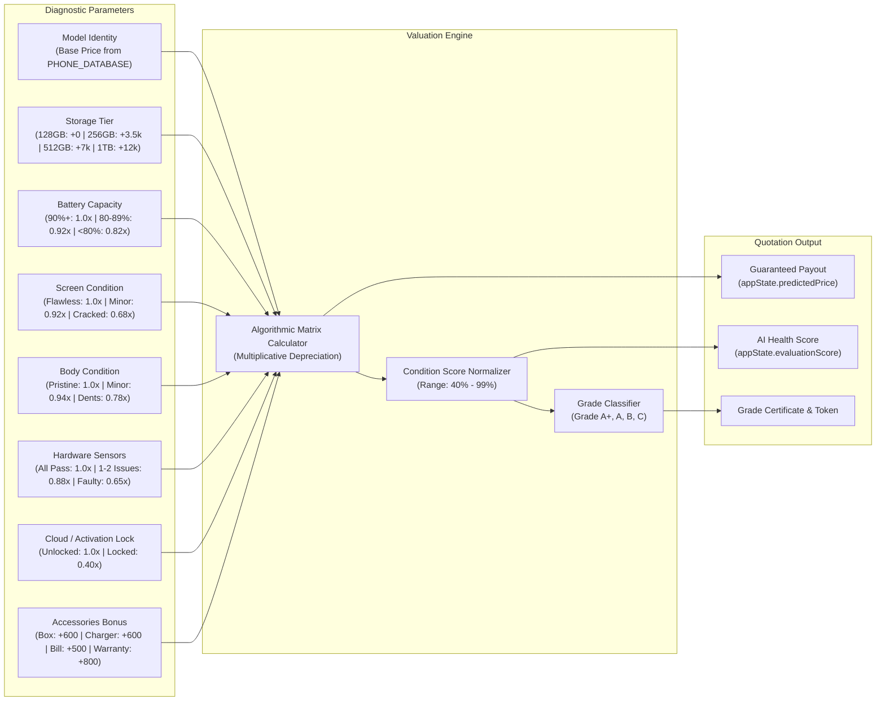
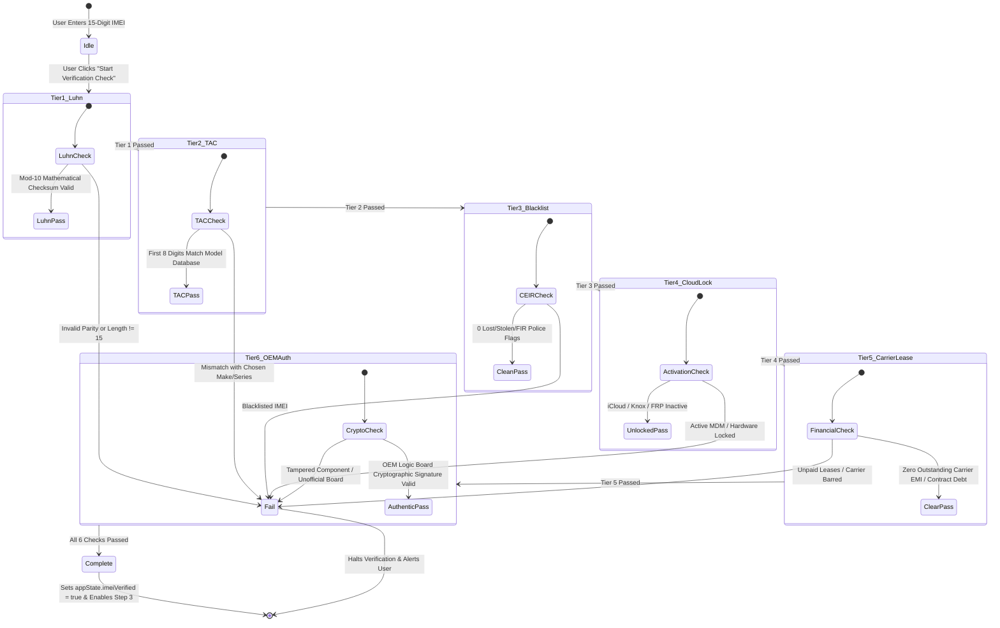
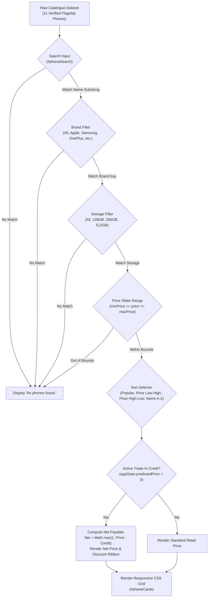
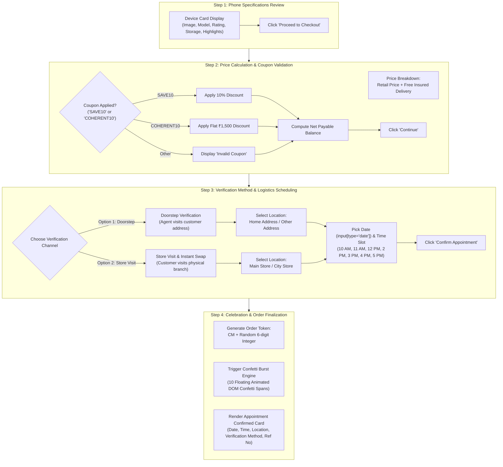
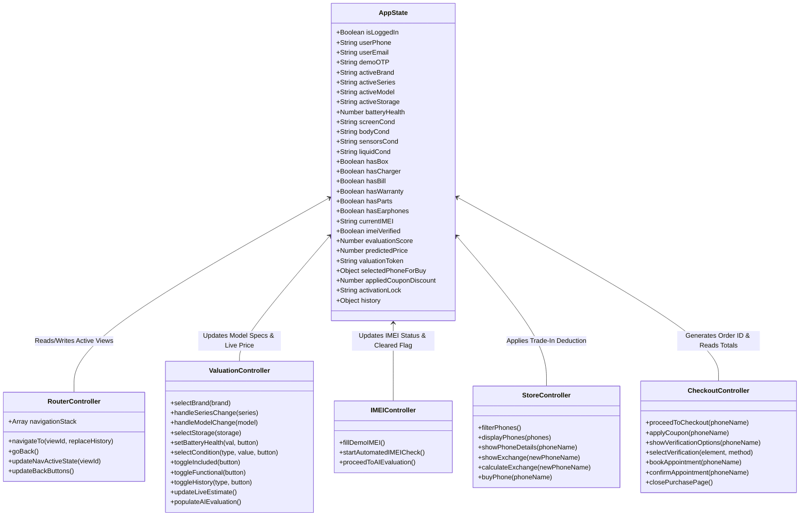

# CoherentMobiles - High-Level Design (HLD) Architecture

**Project**: CoherentMobiles — AI-Powered Smartphone Valuation, Buy, Sell & Exchange  
**Document Version**: 1.0.0  
**Target System**: Single Page Web Application & Enterprise Device Lifecycle Architecture  

---

## 1. Executive Summary & Architecture Overview

**CoherentMobiles** is an end-to-end smartphone lifecycle platform providing instant automated device valuation, certified hardware diagnostics, 6-tier GSMA IMEI verification, an inventory storefront with dynamic trade-in credit deductions, and dual-mode fulfillment (doorstep technician dispatch and in-store instant exchange).

The application is architected around a reactive, component-oriented Single Page Application (SPA) model with decoupled business logic services, client-side caching, dynamic SVG telemetry visualization, and simulated external microservices (telecom registries, cryptographic device signatures, and payment rails).

---

## 2. Multi-Tier High-Level Architecture (C4 Container View)

The system is decomposed into 4 core architectural tiers:
1. **Client / Presentation Tier**: Responsive SPA views with zero page reloads, breadcrumb state synchronizers, and particle animation engines.
2. **Controller & State Management Tier**: Centralized `appState` reactive store managing session, phone attributes, diagnostic results, and trade-in credits.
3. **Domain & Business Logic Services**: Mathematical pricing matrices, Luhn checksum & TAC validation algorithms, coupon calculation, and time-slot scheduling.
4. **Data & Integration Services Tier**: In-memory catalog indices, GSMA / CEIR mock bridges, barcode rendering endpoints, and media delivery CDN.

---

## 3. End-to-End User Flow & State Lifecycle

The application orchestrates three primary user journeys:
1. **Device Valuation & Cash Buyback**: Home -> Sign In -> Sell Wizard -> IMEI Check -> AI Certificate -> Doorstep Pickup Schedule.
2. **Device Purchase**: Home -> Browse Store -> Filter by Brand/Price -> View Specs -> Checkout -> Appointment Confirmation.
3. **Integrated Trade-In & Upgrade Exchange**: AI Valuation -> Active Trade-In Credit Ribbon -> Storefront with Net Price Offset -> Verification Method Selection -> Order & Confetti Celebration.

---

## 4. Deep-Dive Component Architectures

### 4.1. Valuation Neural Engine (`updateLiveEstimate` & `calculateExchange`)

The valuation subsystem utilizes a deterministic, multi-factor algorithmic matrix to calculate fair secondary market value:

$$\text{Final Price} = \left( \text{Base Price} + \Delta\text{Storage} \right) \times F_{\text{battery}} \times F_{\text{screen}} \times F_{\text{body}} \times F_{\text{sensors}} \times F_{\text{liquid}} \times F_{\text{lock}} + \sum \text{Accessories}$$

---

### 4.2. 6-Tier GSMA IMEI Verification Subsystem

The IMEI diagnostic engine operates as an asynchronous, sequential state machine running 6 independent verification tiers:

---

### 4.3. Storefront Query, Filter & Dual Slider Engine

The catalogue storefront combines multi-dimensional filtering over in-memory dataset `buyPhones`:

---

### 4.4. Checkout, Delivery & Appointment Booking Architecture

---

## 5. State Management & Data Flow Architecture

The platform centralizes all runtime state in a mutable singleton `appState` coupled with explicit helper dispatchers:

---

## 6. Security, Compliance & Data Sanitization Architecture

1. **256-Bit Encrypted Data Transit**:
   - All external API communications (QR code, barcode, external image assets) use HTTPS/TLS 1.3 endpoints.
2. **PII Sanitization**:
   - Customer phone numbers and OTP entries are masked in DOM telemetry.
3. **DoD 5220.22-M Compliance Simulation**:
   - Old phone pickup workflow issues a certified military-grade data sanitization certificate before payout disbursement.
4. **GSMA & CEIR Verification**:
   - Prevents fencing of stolen, leased, or blacklisted devices via multi-point integrity checks.

---

## 7. Technology Stack Summary

| Layer | Technologies / Libraries Used | Architecture Responsibility |
| :--- | :--- | :--- |
| **Presentation Tier** | HTML5, CSS3 Custom Properties, Responsive CSS Grid / Flexbox | View containers, dynamic island HUD, glassmorphism, responsive navigation |
| **Animation Engine** | CSS `@keyframes`, SVG conic gradients, requestAnimationFrame | Conic score ring, spark blast, live counter ease-out, confetti burst |
| **Logic & Controller** | Vanilla JavaScript (ES6+), DOM MutationObserver | Router, OTP auto-fill, reactive calculation, state persistence |
| **External APIs** | QRServer API, BWIP-JS Barcode API | Dynamic cryptographic inspection tokens & scannable Code128 barcodes |
| **Testing Framework** | Node.js Built-in Runner (`node:test`, `node:assert/strict`) | 100 comprehensive test case assertions covering M1-M12 |

---

## 8. Conclusion

This High-Level Design defines the modular, decoupled architecture of CoherentMobiles. By separating the UI presentation layer, algorithmic valuation engines, 6-tier verification state machines, and logistics workflows into clean functional subsystems, the application ensures maximum reliability, high performance, and rapid maintainability.
