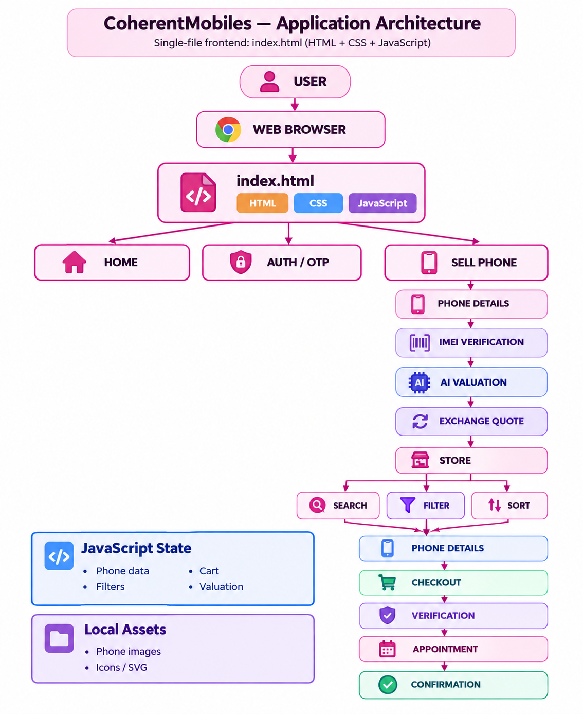
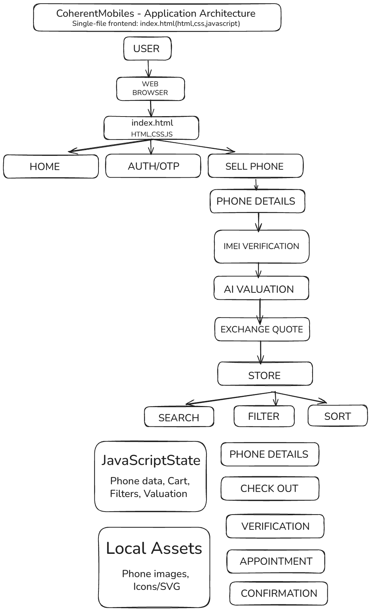
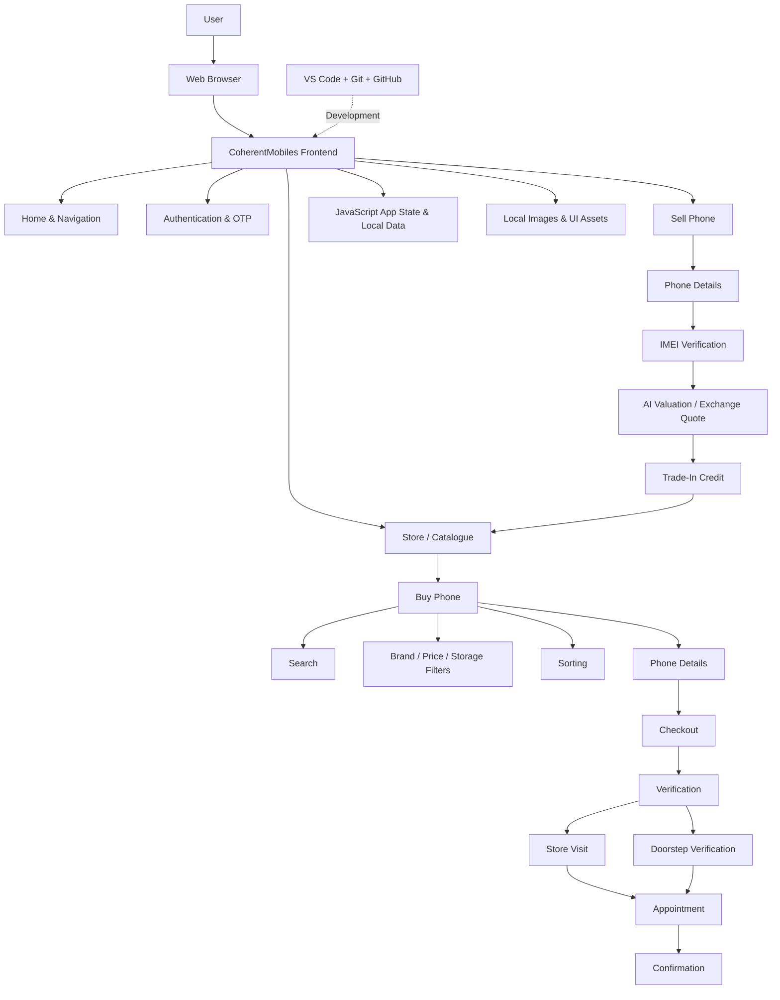

# Coherent Mobiles – Application Architecture

## 1. Overview

Coherent Mobiles is a web-based mobile phone platform that allows users to sell old phones, verify IMEI details, get an exchange valuation, browse phones, search and filter products, purchase phones, complete verification, and book an appointment.

The current application is implemented as a frontend application using HTML, CSS, and JavaScript.





---

## 2. High-Level Architecture



---

## 3. Technology Stack

| Layer | Technology |
|---|---|
| Frontend | HTML |
| Styling | CSS |
| Application Logic | JavaScript |
| UI Runtime | Web Browser |
| Development | VS Code |
| Version Control | Git |
| Collaboration | GitHub |
| Product Data | JavaScript data |
| Assets | Local images / SVG assets |

---

## 4. Major Application Modules

### Home & Navigation
- Landing page
- Navigation bar
- Mobile navigation
- Quick valuation
- Main user entry points

### Authentication
- Phone authentication interface
- Email authentication interface
- Google sign-in interface
- OTP verification flow

### Sell Phone
- Select phone brand
- Select phone model/series
- Select storage
- Select device condition
- Display phone details

### IMEI Verification
- Enter IMEI
- Validate IMEI
- Display verification result
- Continue to valuation

### AI Valuation & Exchange
- Device valuation
- Exchange quote
- Estimated selling price
- Trade-in credit
- Continue to store

### Store / Catalogue
- Browse phones
- Brand selection
- Search phones
- Price filtering
- Storage filtering
- Sorting
- Phone cards

### Buy Phone
- View available phones
- Search by phone name
- Filter by brand
- Filter by price
- Filter by storage
- Sort products
- View phone details
- Buy or exchange

### Phone Details
- Phone information
- Storage/specification information
- Price
- Purchase options

### Checkout
- Selected phone
- Order summary
- Pricing
- Coupon/discount handling
- Continue to verification

### Verification
- Store visit verification
- Doorstep verification
- Verification selection

### Appointment
- Select date
- Select time
- Select location
- Confirm verification method

### Confirmation
- Successful booking/order message
- Appointment information
- Confirmation reference
- Return to store

---

## 5. Application Flow

### Selling Flow

```text
Home
  ↓
Sell Phone
  ↓
Phone Details
  ↓
IMEI Verification
  ↓
AI Valuation
  ↓
Exchange Quote
  ↓
Trade-In Credit
  ↓
Store
```

### Buying Flow

```text
Store
  ↓
Search / Filter / Sort
  ↓
Phone Details
  ↓
Checkout
  ↓
Verification
  ↓
Appointment
  ↓
Confirmation
```

---

## 6. Data and State Management

The current application manages its data and UI state on the frontend using JavaScript.

The application maintains information such as:

- Selected phone
- Selected brand
- Selected model
- Storage
- Device condition
- IMEI verification status
- Predicted exchange price
- Trade-in credit
- Catalogue filters
- Checkout information
- Appointment information

Phone catalogue information is maintained as application data and displayed dynamically in the catalogue.

---

## 7. Assets

The application uses local visual assets such as:

- Phone product images
- SVG icons
- UI graphics
- Logos and interface elements

These assets are used by the frontend to display phone products and improve the user interface.

---

## 8. Frontend Architecture

The application follows a client-side architecture.

```text
User
  ↓
Web Browser
  ↓
HTML
  ├── CSS
  └── JavaScript
       ├── Navigation
       ├── Authentication
       ├── Sell Phone
       ├── IMEI Verification
       ├── AI Valuation
       ├── Catalogue
       ├── Buy Phone
       ├── Checkout
       └── Appointment
```

The HTML provides the page structure, CSS controls the appearance and layout, and JavaScript handles navigation, user interactions, calculations, filtering, and application state.

---

## 9. Backend Status

The current version of the application is primarily frontend-based.

No separate backend server or database implementation is included in the current application version.

The application therefore performs its current interactions and data handling within the browser using JavaScript and local application data.

---

## 10. Development and Collaboration

The project is developed using:

```text
VS Code
   ↓
Git
   ↓
GitHub Repository
   ↓
Feature Branches
   ↓
Pull Requests
   ↓
Team Integration
```

Feature branches are used so team members can work independently before their changes are reviewed and integrated.

---

## 11. Architecture Design Process

The architecture was designed by identifying:

1. The main user journey
2. The browser and frontend layer
3. Major application modules
4. Data and application state
5. Local assets
6. Development and collaboration tools
7. Connections between the modules
8. The complete buying and selling workflows

The architecture represents the complete Coherent Mobiles application rather than a single team member's contribution.

---

## 12. Summary

The Coherent Mobiles application follows a frontend-focused architecture where the user interacts with the application through a web browser.

The main application modules are connected through JavaScript-driven navigation and state management. The platform supports both selling and buying phone journeys, including IMEI verification, valuation, catalogue browsing, search and filtering, checkout, verification, appointment booking, and confirmation.

Git and GitHub are used to manage source code and support team collaboration.